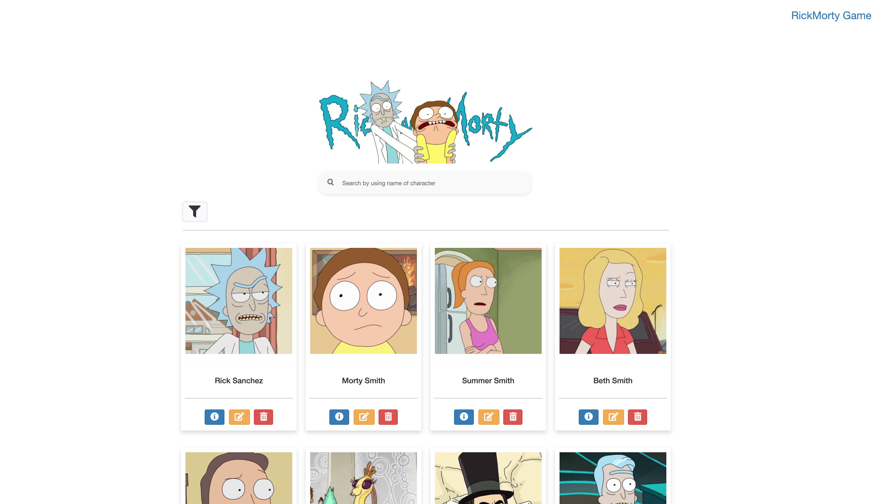
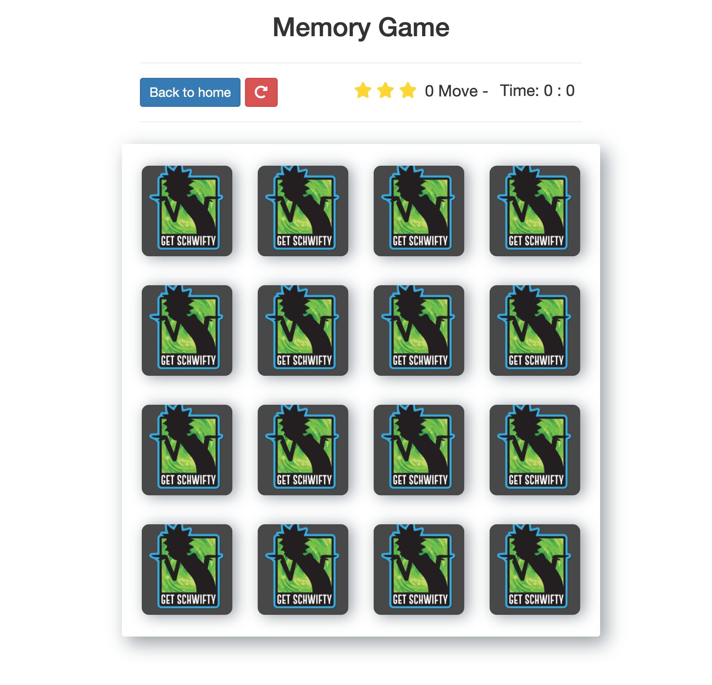

# Project-unit-1

Hello everyone 
- This repo for my first project in Tuwaiq academy whitch is an website that display RickMorty Characters + Momery Game

## Functionalities in the website:
- Add new characters
- Remove any characters 
- Search for characters
- update characters

## Tools used:
- Bootstrap: CSS framework for developing responsive website.
- Trello: Project management tool to orgnize the time and work.
- Figma: Wireframing thats help me to design my website befor jumpping into coding
- RickMorty API  https://rickandmortyapi.com/api/character`

## Problem encountered:
-  Auto Complete search 

## Links:
- Here is the link of Figma wireframe => https://www.figma.com/file/GHtiN8cBHRlBtLKQwZswSQ/RickMortyApi?node-id=0%3A1
- Here is the link of Trello board => https://trello.com/invite/b/MCYlKave/effb3ea1df3a5a35a1cf72d6368d2174/rickmorty-project

## Output 

